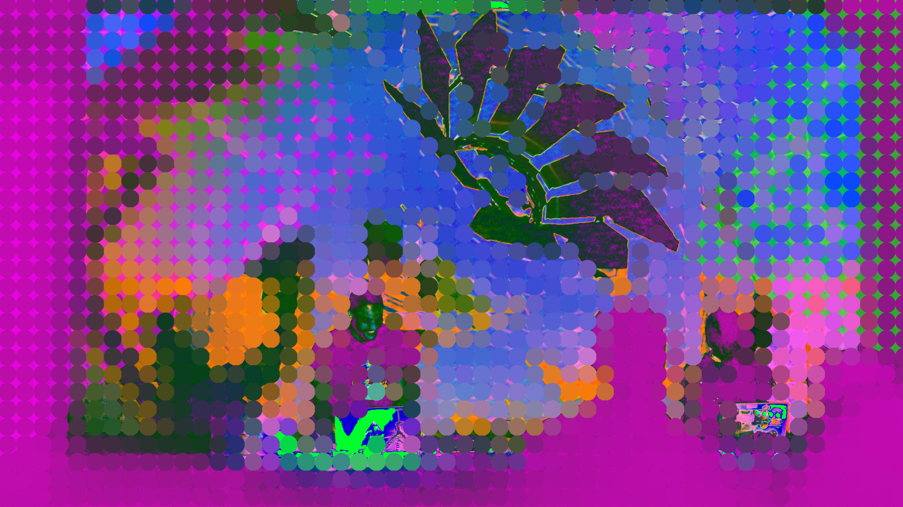

<!-- # 💻 -->

<h1 id="cover-heading">
  DECODED --
</h1>
<h2 id="cover-heading">
  An Artistic Livecoding Workshop
</h2>

[Estuary](estuary/README.md)
[Audio (minitidal)](minitidal/README.md)
[Visual (punctual)](punctual/README.md)

<!-- background image -->

