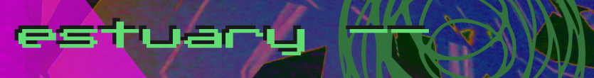
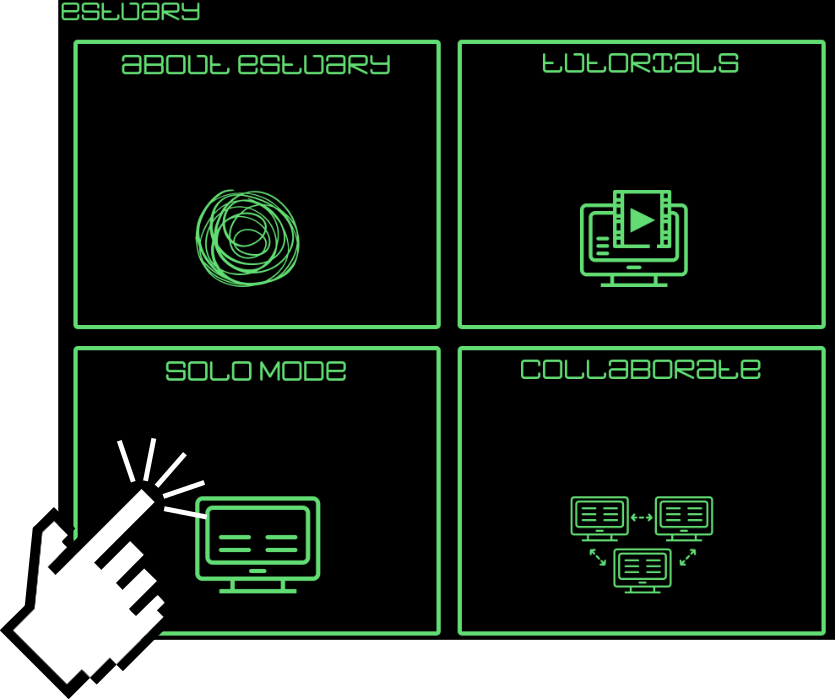
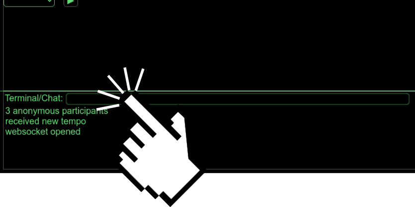
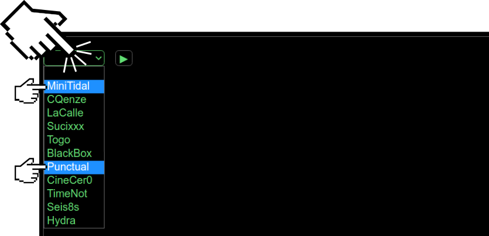
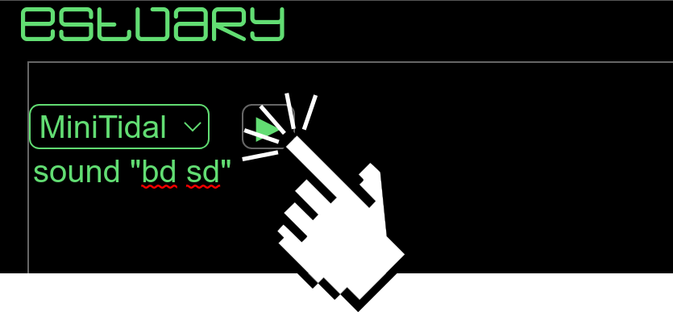
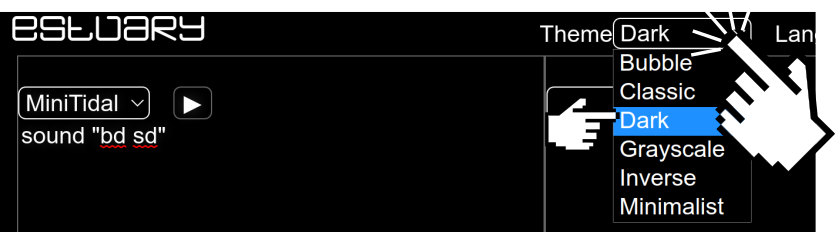

## About

[Estuary](https://estuary.mcmaster.ca) is a platform for collaboration and learning through live coding. It enables you to create sound, music, and visuals in a web browser using a variety of **Live Coding** languages.

Key features of Estuary include:

  - web-based (no installation required to get up and running)
  - a growing collection of different interfaces and supported live coding languages
  - collaborative by design, providing support for networked ensembles (in the same room or around the world)
  - free and open source! Check it out on [Github](https://github.com/dktr0/estuary)
  - for this course, we will be making use of the Estuary instance generously hosted for public use by McMaster University, Canada, at [https://estuary.mcmaster.ca](https://estuary.mcmaster.ca)

## Requirements:
 - Chrome or Chromium browser

## Support
 - [Discord](https://discord.gg/E9vuAUBAeW)

## Getting Started for the Workshop

---

### Enter Solo Mode

### Setup Cells (see Worksheets)

### Select a Livecoding Language

### Evaluate Code

### Change the Theme

**[Copyright](/COPYRIGHT.md)**
