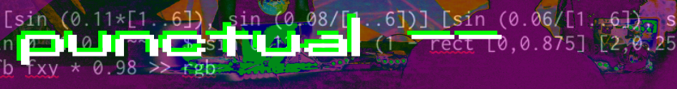

# Punctual Visual Workshop 1-2 - Moving Things Around (~1h)

**Goals:**
 - change parameters to control brightness of your visuals
 - create and use continually changing values
 - create and use values based on Audio Input

**Reference:** 
 - https://estuary.mcmaster.ca
 - https://github.com/dktr0/Punctual/blob/main/REFERENCE.md

## Setup Cells!

```
!presetview twocolumns
```

 - Left Cell: `Punctual`
 - Right Cell: `MiniTidal`

---

## Controlling Brightness

Once we start moving things around, visuals can start getting very bright and flashy which, depending on your audience can be quite dangerous.

There are several ways to **stop** the visuals

**The Nuke option:** Select all the text in the cell using your mouse or `ctrl+A` as a keyboard shortcut, delete it and evaluate the blank cell

*Note that `ctrl+z` (undo) will bring your text back into the cell without re-evaluating it*

**The Finegrained Option:** `--` can be used at the front of the line of code to indicate it is a *comment* and should be ignored by punctual. This is a good option if you have multiple patterns, and only need to remove one of them
```
-- circle [0,0] 0.25 >> video;
```

We can also *control the brightness* of that final value by appending a brightness value to our code - try this in the **Punctual** column
```
circle [0,0] 0.25 * 1 >> video;
```

By default, Punctual uses a brightness value of `1` so you can get away without specifying it (try/compare it!)
```
circle [0,0] 0.25 >> video;
```

You can reduce the brightness by half by changing the `1` to `0.5` (or half of 1)
```
circle [0,0] 0.25 * 0.5 >> video;
```

Brightness can also be specified on an individual channel basis. In this example we apply individual brightness values to each of the `red`, `green`, and `blue` (`RGB`) channels in the `video` output by putting each individual brightness value in a comma separated list, surrounded by `[ ]` brackets
```
circle [0,0] 0.25 * [0.25, 0.5, 0.75] >> video;
```

The `blue` channel has the highest value of the three at `0.75` so we would expect our circle to be mostly `blue` coloured - is it?

***Note: If things get way out of control and you need to stop the visuals in a hurry, the easiest way is to delete all the code in your Punctual cell(s), and evaluate the (now blank) cell(s)***

---

## Oscillators

> *What is an Oscillator?*
> 
> An Oscillator is a "Signal Generator", generating a continuous, repeating pattern of signals.
>
> In Punctual, an Oscillator signal generates values between `1` and `0` inclusive

This is an example of a `sine` oscillator, notice how the ball in the middle follows the sine wave shape over time. The sine wave has a specific characteristic that it tends to accelerate towards the middle, then decelerate after it passes the mid-point


An oscillator in Punctual has a **frequency value** that lets you specify the speed with which the oscillator moves between `0` and `1` - in the below punctual example, we use `0.25`
```
circle [0, sin 0.25] 0.02 >> video;
```

This means that it moves between `0` and `1` much slower than (or specifically, at one quarter the speed of) `sin 1` - try increasing the speed to `1`!
```
circle [0, sin 1] 0.02 >> video;
```

***It's important to keep the oscillator frequency value low so it remains visible*** 

Notice how our circle follows the same acceleration/deceleration pattern as the ball in the animation when we put the oscillator in the `y` coordinate position?

Other oscillator waveforms available in Punctual include: `tri`, `saw`, and `sqr` - try them out!

We can replace any number in a Punctual pattern with an **Oscillator**. This includes `x` and `y` coordinates, `radii`, brightness values and more - try some experiments with your code examples!

---

## Audio Frequency Graphs

Punctual has graphs which provide current audio frequency values (ie what sounds estuary is currently producing) and splits them into 3 "bins" - `hi`, `mid`, and `lo`

 - Low frequency sounds (eg a kick drum) create values on the `lo` graph
 - Mid frequency sounds (eg a snare drum) create values on the `mid` graph 
 - High frequency sounds (eg a hihat cymbal) create values on the `hi` graph

Setup a simple sound in the right hand estuary cell (make sure `MiniTidal` is selected from the language dropdown):
```
sound "bd"
```

`bd` is a predominantly low frequency sound (less than 1000Hz), in the left hand cell configure a `rect` who's height is controlled by `lo`
```
rect [0] [0.2,lo] >> blue;
```

Notice how the `rect` height is largest when the `bd` sound is loudest, and how the `rect` size reduces as the `bd` sound fades away? 

The shape of the `lo` graph (and all Audio Graphs) is controlled by the various sound frequencies created in Estuary.

In the punctual cell, try replacing `lo` with the `mid` and `hi` frequency graphs, how do you expect them to react to the `bd` sound?

Pick some different frequency sounds (eg `sd`, `hc`) and see how the different bins react -

`fft` provides a detailed spectrum analysis ([Fast Fourier Transform](https://www.electronics-notes.com/articles/test-methods/spectrum-analyzer/fft-fast-fourier-transform-spectrum-analyser.php)) of the current sound output

A very simple example is to apply `fft` to our whole screen (make sure you still have your beat going)
```
fft 1 >> video
```

It gets much more interesting when we apply it to shapes
```
circle [0, fft 1] 0.2 >> video
```

Bouncy, right? It gets **even** more interesting when we include the `fx` and `fy` (or even, `fxy`) graphs which return the position of the current *"fragment"* along the `x` or `y` axis
```
circle [0, fft fy] 0.2 >> video
```

---

# Exercises:

1. Begin with our example of a vertically moving `circle` using the `sin` oscillator. In the same cell, create a vertically moving `circle` using the `tri` oscillator moving at the same speed
```
circle [0, sin 0.25] 0.02 >> video;
``` 

2. Describe the difference you see between `sin` and `tri` (hint, keep the oscillator value 1 or below)

3. Modify our brightness example, to use the `sqr` oscillator to control the circles brightness
```
circle [0] 0.25 * 0.5 >> video;
```

4. Create a simple beat in one column with MiniTidal (`sound "bd"`). Then modify the answer from the previous question to make a circle appear/disappear in time with the beat 


## For Bonus Points

5. Create 3 `rect` objects using the below code, then modify it so each `rect` changes size based on a different audio frequency bin (`lo`, `mid`, `hi`). In the Minitidal cell, setup a simple beat or sound with a variety of frequencies to test/showcase your audioreactive `rect` obects 
```
rect [-0.5,0] [0.25,0.1] >> video;
rect [0,0] [0.25,0.1] >> video;
rect [0.5,0] [0.25,0.1] >> video;
```

6. Create a vertically moving circle using the example code below. Notice the `circle` oscillates between the top and bottom of the screen (`0` and `1`). Try applying an **arithmetic function** to the oscillator, to reduce the distance the circle moves on the y axis
```
circle [0, sin 0.5] 0.25 >> video;
```

7. Investigate the effects of replacing more of the circle parameters with `fft` graphs, beginning with our earlier example:
```
circle [0, fft fy] 0.2 >> video
```

---
