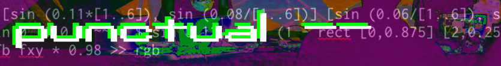

# Punctual Visual Workshop 1-4 - Jigging With the Numbers (~1h)

**Goals:**
 - learn how to use *variables*, and why they're useful
 - apply transform functions to modify your visuals
 - use images and videos in your creations

**Reference:**
 - https://estuary.mcmaster.ca
 - https://github.com/dktr0/Punctual/blob/main/REFERENCE.md

## Setup Cells!

```
!presetview twocolumns
```

 - Left Cell: `Punctual`
 - Right Cell:  Your choice!

---

## Connecting Geometry Altering Functions with `$`

Punctual includes 4 "fixed" transform functions for shifting an image around on the canvas:
 - `spin [amount] [...]`
 - `zoom [x,y] [...]`
 - `tile [x,y] [...]`
 - `move [x,y] [...]`

These functions can be used in combination with the haskell `$` operator

The least confusing technical description of `$` in haskell I've found is:

> "You usually see $ where standard function application wouldn’t have the necessary associativity and precedence for the context. And what *that* means is you usually see it used instead of parentheses to associate things that otherwise wouldn’t.
> [typeclasses.com](https://typeclasses.com/featured/dollar)

Let's do some testing by applying `spin` to a `hline`- starting with a static `hline`:

```
hline 0 0.2 >> add;
```

It is possible to apply the `spin` transform function using parentheses:

```
spin 1.25 (hline 0 0.2) >> add;
```

However, parentheses can be difficult to match, especially in a complicated punctual statement so let's use `$` for this example instead

```
spin 1.25 $ hline 0 0.2 >> add;
```

Much simpler! `spin` is applied to everything after the `$`! So easy, but...

What about if we want to apply multiple transform functions? Let's look at `spin` in combination with `tile`

First, let's get spin using a changing value - `tri 0.125`:

```
spin (tri 0.125) $ hline 0 0.2 >> add;
```

Next, let's add `tile` as a prefix to the entire statement:

```
tile 4 $ spin (tri 0.125) $ hline 0 0.2 >> add;
```

What's happening here? Is `spin` being applied before `tile` or afterwards?

If we consider what the output looks like, there are 16 (4x4) spinning lines, so a spinning line was created, and then tiled.

We can verify with parentheses:

```
tile 4 (spin (tri 0.125) $ hline 0 0.2) >> add;
```

Everything inside the parentheses is evaluated first, then `tile` is applied

Let's swap `tile` and `spin`:

```
spin (tri 0.125) $ tile 4 $ hline 0 0.2 >> add;
```

Describe what has happened here? If necessary, break the function into pieces, or use parentheses to verify

---

## New Flexible Geometry Altering Functions

As of Punctual 4.0, a series of more `setf*` functions were provided, that now let us play all sorts of transformation games with any expression!

 - `setfx [x1,x2,...]` - remap `fx` by setting it to the value of a specific expression
 - `setfy [y1,y2,...]` - remap `fy` by setting it to the value of a specific expression
 - `setfxy [x1,y1,x2,y2,...]` - remap `fxy` by setting it to the value of a specific expression

Here's a quirky example using `setfxy`:

```
setfxy (fxy +: (osc fxy * 0.5)) $ circle 0 0.5 >> add
```

---

## Using Variables to Simplify Your Code

By now you will notice that your code statements are getting longer. You may be using multiple transform functions, you may even want to use some of the comparison functions with multiple complex statements ... fitting these statements onto one line can get unwieldy fast!

If we take the `circle`s example from the previous workshop exercises

```
(circle [0,0] 0.25) + (circle [0.15,0.15] 0.35) >> add;
```

We can define the two `circle` statements separately, and store their output in a variable name (`a` and `b` in the example below). Then those variables can be referenced in a third statement. Here is the equivalent statement, using variables:

```
a << (circle [0,0] 0.25);
b << (circle [0.15,0.15] 0.35);
a + b >> add;
```
Nice and simple! Plus we can reuse the variables as many times as we like - let's reuse it with `min` and add some oscillators and functions for fun

```
a << (circle [0,0] 0.25);
b << (circle [0.15,0.15] 0.35);
a + b >> add;
tile 4 $ min (osc a) (tri b) >> add;
```

I think you will agree, this is much more readable - not to mention, you only need to modify the variable in one place, and it will update on both statements that use it

---

## Image and Video manipulation!

`img` and `vid` are functions for accessing textures built from an image or video file respecitvely (specified as a web address)

There is one major caveat in using these functions, the resources must be hosted on a [CORS compliant](https://developer.mozilla.org/en-US/docs/Web/HTTP/CORS) web server -

Fortunately, two of the biggest (and most interesting) repositories of *permissively licensed* content are CORS compliant:

 > - [commons.wikimedia.org :: Images](https://commons.wikimedia.org/wiki/Category:Images)
 > - [commons.wikimedia.org :: Videos](https://commons.wikimedia.org/wiki/Category:Videos)
 > - [flickr :: Images](https://www.flickr.com/search/?text=creative%20commons&license=7%2C9%2C10&media=photos)


Let's begin with images - search for an image file on either [flickr :: Images](https://www.flickr.com/search/?text=creative%20commons&license=7%2C9%2C10&media=photos), or [commons.wikimedia.org](https://commons.wikimedia.org/wiki/Category:Images), or [pick one at random](https://commons.wikimedia.org/wiki/Special:Random/File)

To use the file, you will need the web address (or URL) of the image:
 - For wikimedia: find the "Original File" link under the image, right-click it and "Copy link address"
 - For flickr: click for the download icon in the bottom right corner, then right click the size you want and "Copy link address"

Paste your copied image address in the following examples (or use my example):

```
img "https://img.grbt.com.au/brain.jpg" >> add;
```

That's probably looking a bit stretched/distorted right now ...

By default, images and videos are stretched to fit the height and width of the estuary window - however, you can force the *aspect ratio* to be whatever you want using `fit`, and provide the `width` and `height` as a ratio

```
fit (3/4) $ img "https://img.grbt.com.au/brain1.jpg" >> add;
```

That's better! Tweak it some more if you feel like it could be improved

For motion video playback, just use the `vid` function in place of `img` - grab a video from [commons.wikimedia.org](https://commons.wikimedia.org/wiki/Category:Videos) (or use the example below), and try it out

```
vid "https://upload.wikimedia.org/wikipedia/commons/2/20/Enduro_Madeira_Island%2C_GoPro.webm" >> add
```

*Note that `vid` is a basic looped playback function only, there are no playback controls (pause/rew/playback speed etc), and no audio playback*

---

## Transitions!

To reduce the harshness of what can sometimes be quite jarring changes, we can append a transition operator `<>` after the output destination.

`<>` takes one argument, a floating point number in seconds to describe how long it should take to replace the original pattern with the new pattern, using a "fade" effect

Continuing on from the image example above, what if we changed the image? Perfect time to apply a transition effect - grab a new image from [commons.wikimedia.org](https://commons.wikimedia.org/wiki/Category:Images), and add it to your code with a 10s transition:

```
fit (3/4) $ img "https://img.grbt.com.au/scream.jpg" >> add <> 10;
```

Punctual 4.0 introduced a new `zero/zer0` function which is quite useful with fadeouts, while keeping your code intact - try appending the `zero` function to our example:

```
zero $ fit (3/4) $ img "https://img.grbt.com.au/scream.jpg" >> add <> 10;
```

To bring your visual back, you can just remove the `zero $` prefix

---

# Exercises:

1. Investigate using oscillators, or audio reactive graphs with `fit` parameters
```
fit (3/4) $ img "https://img.grbt.com.au/scream.jpg" >> add <> 10;
```

## For Bonus Points

2. `prox [x,y,...]` is an interesting graph for warping parameters - investigate it's use with images and/or videos, in conjunction with oscillators, geometry altering functions, and output values
```
fit ((prox 0.2)/4) $ img "https://img.grbt.com.au/scream.jpg" * [prox (sin 0.2),0,0] >> add <> 10;
```
---
